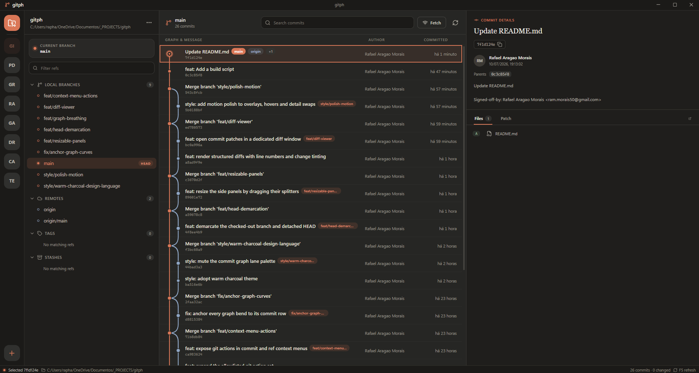
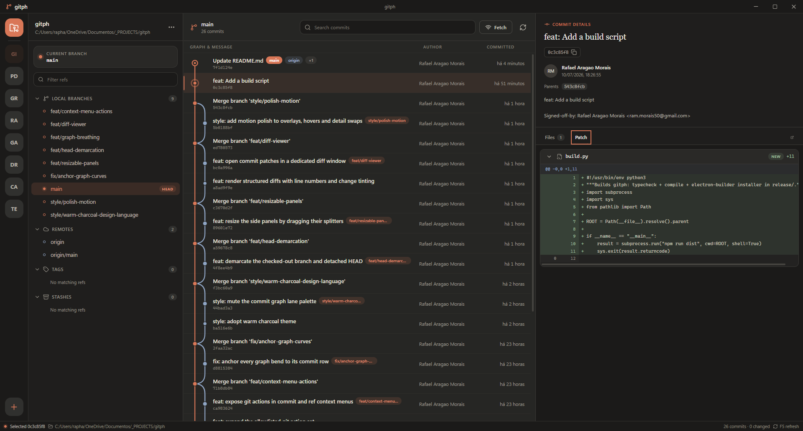
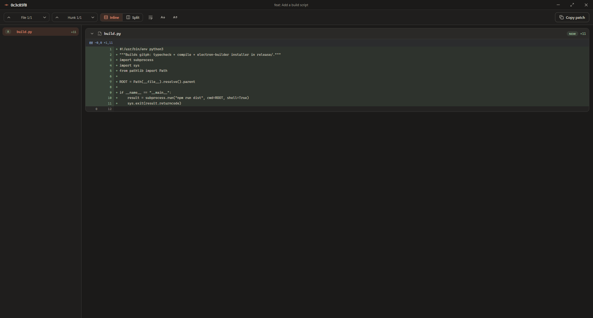
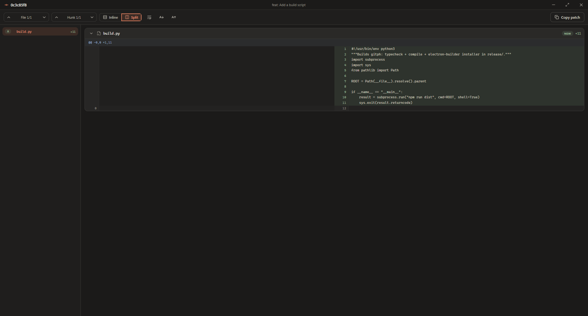
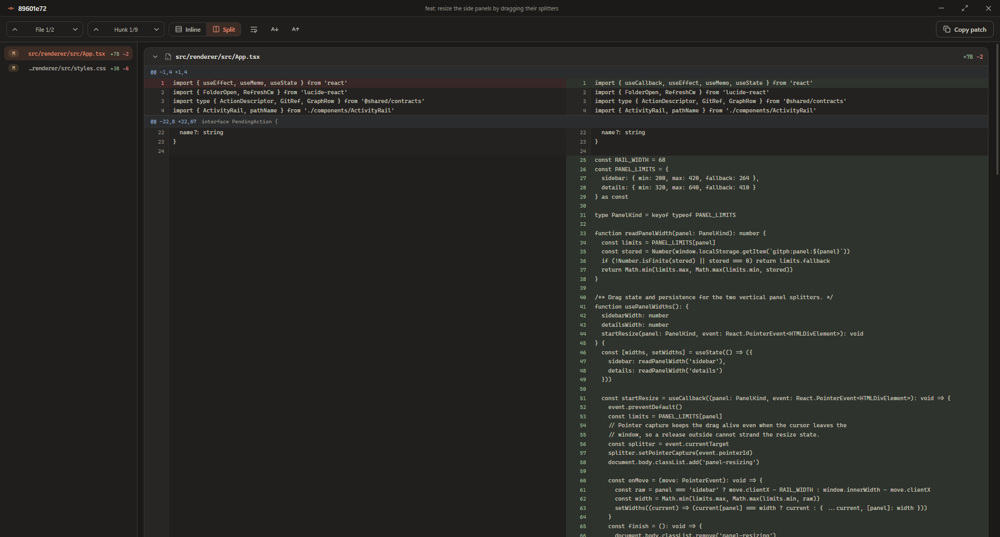

# Gitph

Gitph is an Electron desktop client for inspecting and operating on local Git repositories. It renders up to 500 commits from all refs as a lane graph, groups local branches, remote branches, tags, and stashes, and shows commit metadata, changed files, and unified patches.

Mutating operations are available from commit and ref context menus. The main process rebuilds each command from an allowlist before invoking Git; the renderer never supplies raw command arguments.

## Screenshots

### Repository overview



*The main workspace keeps repository refs, commit lanes, and the selected commit's metadata and changed files in one view.*

### Patch in the main workspace



*The Patch tab displays a selected commit's diff without leaving the repository graph.*

### Inline diff



*The dedicated diff window provides file and hunk navigation, line numbers, display controls, and patch copying.*

### Split diff



*Split mode aligns the old and new sides of each hunk for direct comparison.*

### Multi-file patch



*The file sidebar lists every changed file with its status and line totals while the selected patch remains visible.*

## Requirements

- Node.js 22.12 or newer
- npm
- Git available on `PATH`
- Python 3 only when using the optional `build.py` wrapper

The lockfile currently uses Electron 43, whose package exposes its binary installer separately. Install that binary after restoring npm dependencies.

## Quick start

```sh
npm ci
npx --no-install install-electron
npm run dev
```

The development command builds the Electron main and preload processes, starts the renderer on `http://localhost:5173`, and opens the desktop application.

Use `Ctrl+O` (or `Cmd+O` on macOS) to open a repository. Press `F5` to refresh its status, refs, and commit graph.

## Commands

| Command | Purpose |
| --- | --- |
| `npm run dev` | Start Electron with the Vite development server. |
| `npm run typecheck` | Run TypeScript without emitting files. |
| `npm run build` | Type-check and write production bundles to `out/`. |
| `npm start` | Build and open the production preview. |
| `npm run dist` | Build and create the configured desktop package. |
| `python build.py` | Run the same `npm run dist` pipeline through Python. |

Packaging is configured for a Windows NSIS installer. Output is written to `release/`, including `win-unpacked/` and `Gitph Setup <version>.exe`; the verified build produced an x64 package.

## Repository workflow

Gitph reads repository status, refs, and topologically ordered history through the Git CLI. The interface supports:

- searching commits by hash, subject, author, or ref;
- filtering local branches, remotes, tags, and stashes;
- inspecting commit bodies, parents, changed files, and patches;
- viewing patches inline or in a separate window with inline and split layouts;
- fetching, fast-forward pulling, pushing, switching, merging, and rebasing branches;
- creating and deleting branches or tags, tracking remotes, cherry-picking, reverting, and resetting.

Every mutating action shows the exact Git command and requires confirmation before execution. High-impact actions are marked separately, and operations such as switching, merging, rebasing, cherry-picking, and reverting require a clean working tree.

The separate patch window supports `j`/`k` for file navigation, `n`/`p` for hunks, `s` for inline or split mode, `w` for line wrapping, and `Esc` to close.

## Code layout

| Path | Responsibility |
| --- | --- |
| `src/main/` | Electron windows, IPC validation, repository session state, settings, and Git services. |
| `src/main/git/` | Git subprocess execution, output parsing, graph layout, repository reads, and allowlisted actions. |
| `src/preload/` | Typed `window.gitph` bridge between the renderer and IPC. |
| `src/renderer/` | React interface for repositories, refs, commit lanes, details, dialogs, and diffs. |
| `src/shared/` | DTOs, action kinds, and IPC channel contracts shared by all processes. |

The browser window runs with context isolation and sandboxing enabled, with Node integration disabled. Git commands run through `spawn` without a shell, use explicit argument arrays, time out after 30 seconds by default, and reject output above 64 MiB.

## Main dependencies

| Dependency | Role |
| --- | --- |
| Electron 43 | Desktop runtime and native window/IPC APIs. |
| React 19 and React DOM 19 | Renderer component model. |
| Lucide React | Interface icons. |
| electron-vite 5 and Vite 7 | Development server and process-specific bundles. |
| TypeScript 7 | Static type checking across main, preload, renderer, and shared contracts. |
| electron-builder 26 | Application packaging and the Windows NSIS installer. |

There is currently no automated test script or CI workflow. Before submitting changes, run:

```sh
npm run typecheck
npm run build
```
